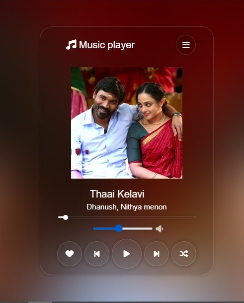

# Music Player

This is a simple music player created using HTML, CSS, and JavaScript.

## Screenshot

## Features
- Play, pause, and stop music
- Display current track information
- Volume control
- Playlist management

## Usage
1. Clone the repository
